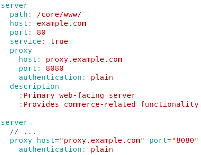

# vim-bml

Syntax highlighting for the BML Markup Language.

Example (using the default color scheme):



## Installation

### Using [Vundle](https://github.com/VundleVim/Vundle.vim)

Add the following to your `~/.vimrc`
```vimrc
Plugin 'qu1x/vim-bml'
```
